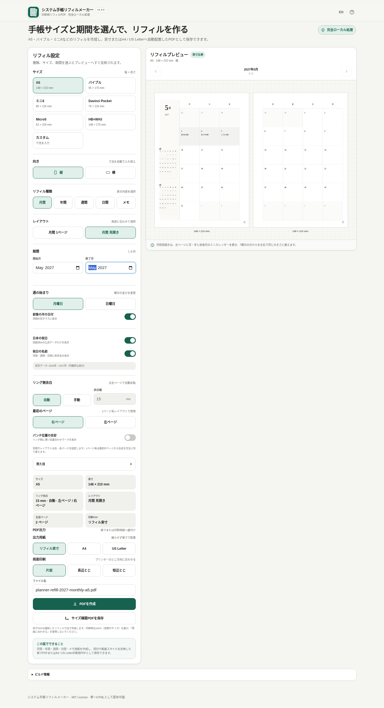

# システム手帳リフィルメーカー / Planner Refill Maker

[](https://github.com/ttomohisa/htmlapps-planner-refill-maker/actions/workflows/deploy-pages.yml)
[](LICENSE)
[](https://ttomohisa.github.io/htmlapps-planner-refill-maker/)

[English README](README.md)

A5・バイブル・ミニ6・Micro5・HB×WA5・Davinci Pocket・カスタムサイズのシステム手帳リフィルを作る単一HTMLアプリです。日付入りリフィルやメモ用紙をブラウザー内で生成し、設定や生成内容を外部サーバーへ送らず、実寸PDFまたはA4 / US Letterへの面付けPDFとして保存できます。

## 🚀 デモ

### [GitHub Pagesでシステム手帳リフィルメーカーを開く](https://ttomohisa.github.io/htmlapps-planner-refill-maker/)

GitHub Pagesから最初のHTMLを読み込んだ後、カレンダー生成・プレビュー・面付け計算・PDF生成は端末内で処理されます。

[](https://ttomohisa.github.io/htmlapps-planner-refill-maker/)

## 主な機能

- **実際の手帳サイズで作成** — A5、バイブル、ミニ6、Davinci Pocket、Micro5、HB×WA5、縦 / 横、カスタム寸法に対応します。
- **月間・年間・週間・日間・メモ** — 月間1ページ / 見開き、年間1ページ / 見開き、週間ブロック / 週間+メモ / バーチカル、1日1ページ、横罫・方眼・ドットを作成できます。
- **見開きを前提にした月間レイアウト** — 左右ページの日セルを同じ大きさにし、左ページに月・年と先月 / 来月のミニカレンダーを配置します。
- **日本の祝日** — 2026年・2027年の確認済みデータを内包し、土曜・日曜・祝日の色を個別指定、祝日名の表示も切り替えられます。
- **印刷向けの見た目調整** — Minimal / Classic / 余白狭め、モノクロ / アクセント、文字サイズ5段階、罫線、ページ番号、週番号に対応します。
- **リング側を考慮した配置** — 自動 / 手動リング余白、左右ページの反転、最初のページ指定、パンチ位置の目安を利用できます。
- **実寸PDF・面付けPDF** — リフィルそのものの実寸PDF、またはA4 / US Letterへ縮小せず配置したPDFを保存できます。
- **両面印刷と仕上げ** — 片面 / 長辺とじ / 短辺とじ、裁断ガイド、表裏の配置プレビュー、必要時の最終裏面空白追加に対応します。
- **サイズ確認PDF** — 100 mm確認線と50 × 50 mmの確認枠で、プリンターの拡大縮小を確認できます。
- **完全ローカル処理の単一HTML** — 日本語 / 英語、PC / スマートフォン、設定のブラウザー内保存に対応し、実行時のAPI・CDN通信を必要としません。

## すぐに使う

### Webで使う

[GitHub Pages版を開く](https://ttomohisa.github.io/htmlapps-planner-refill-maker/)だけで利用できます。アカウント登録やインストールは不要です。

### 単一HTMLをダウンロードして使う

1. このリポジトリの `dist/index.html` をダウンロードします。
2. 現行のChrome / Edge / Firefox / Safariで開きます。
3. 手帳サイズとレイアウトを選び、PDFを作成します。

`dist/index.html` は `file://` から直接開ける構成です。

## 使い方

1. 使用するシステム手帳の実寸サイズと縦 / 横を選びます。
2. 月間 / 年間 / 週間 / 日間 / メモを選び、レイアウトを指定します。
3. 日付範囲またはメモ枚数を設定します。週間バーチカルと日間では時間帯も指定できます。
4. 月曜始まり / 日曜始まりを選び、必要なら月間の前後月日付を表示します。
5. 必要に応じて日本の祝日を有効にし、「見た目」で休日色・スタイル・文字サイズ・罫線・ページ番号・週番号を調整します。
6. リング側余白は自動のまま使うか、4〜30 mmで手動指定します。1ページ系では最初のページを右 / 左から選べます。
7. プレビューを確認します。月間見開きはPDFと同じCanvasページ描画を使い、画面と保存結果のレイアウト差を抑えています。
8. 出力用紙を **リフィル実寸 / A4 / US Letter** から選びます。A4 / Letterではリフィルを縮小せず、用紙向きと配置数を自動計算します。
9. 片面 / 長辺とじ / 短辺とじを選び、必要なら裁断ガイドを有効にします。
10. PDFを作成し、端末へ保存します。

印刷時は **100% / 実際のサイズ** を選び、「用紙に合わせる」は使用しないでください。

## GitHub Pagesで公開する

このリポジトリにはGitHub Pages用のワークフローが含まれています。

1. リポジトリ名を `htmlapps-planner-refill-maker` としてGitHubへプッシュします。
2. **Settings → Pages → Build and deployment → Source** で **GitHub Actions** を選択します。
3. `main` へプッシュするか、ActionsからPagesワークフローを手動実行します。
4. `https://ttomohisa.github.io/htmlapps-planner-refill-maker/` で公開されます。

## 開発とビルド

```text
.
├─ src/index.template.html       # アプリ本体テンプレート
├─ app.config.json               # アプリ情報・ビルド設定
├─ assets/
│  ├─ favicon.svg
│  ├─ screenshot.png
│  └─ screenshot-en.png
├─ tests/                        # 回帰・契約テスト
├─ scripts/                      # リポジトリ検査・ビルド補助
├─ build-standalone.bat          # Windows用ビルド入口
├─ build-standalone.ps1          # 単一HTML生成
└─ dist/
   ├─ index.html
   └─ index.self-extract.html
```

Windowsでビルド:

```powershell
.\build-standalone.bat
```

リポジトリチェック:

```powershell
powershell.exe -NoLogo -NoProfile -ExecutionPolicy Bypass -File .\scripts\check-repository.ps1
```

`dist/` の生成済みHTMLは直接編集しません。

## プライバシーと通信防止

手帳設定、カレンダー生成、プレビュー描画、PDF生成はブラウザー内で処理します。

生成HTMLには `connect-src 'none'` を含むContent Security Policyを設定しています。実行時のAPIやCDNを必要としません。次回も使う設定はブラウザーのローカルストレージに保存します。

GitHub Pages版では最初のHTMLを取得する通信は発生します。ネットワークを切った状態で使う場合は `dist/index.html` をローカルで開いてください。

## 制限事項

- 日本の祝日データは **2026年・2027年のみ**内包しています。未収録年を推測して祝日表示することはありません。
- パンチ位置は位置合わせの目安であり、各手帳メーカーの正確な穴位置を保証するものではありません。
- 日付入力は1900年1月〜2100年12月、選択期間は最大60か月です。
- 長い期間のPDF生成や、メモリの少ないスマートフォンでは処理負荷が高くなる場合があります。
- A4 / US Letter面付けでは、収まらないリフィルを自動縮小しません。実寸で入らない場合はエラーを表示します。
- 正しい実寸で印刷するには、プリンター側を **100% / 実際のサイズ** に設定する必要があります。

## 使用ライブラリ

実行時に外部ライブラリを読み込む構成ではありません。PDF生成とレイアウト処理は単一HTMLに含まれます。詳細は [THIRD_PARTY_NOTICES.md](THIRD_PARTY_NOTICES.md) を確認してください。

## コントリビューション

バグ報告や機能提案はGitHub Issuesからお願いします。開発への参加方法は [CONTRIBUTING.md](CONTRIBUTING.md) を確認してください。

## ライセンス

Copyright © 2026 ttomohisa

このプロジェクトは [MIT License](LICENSE) で公開されています。
